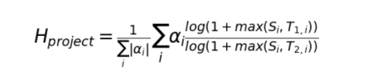
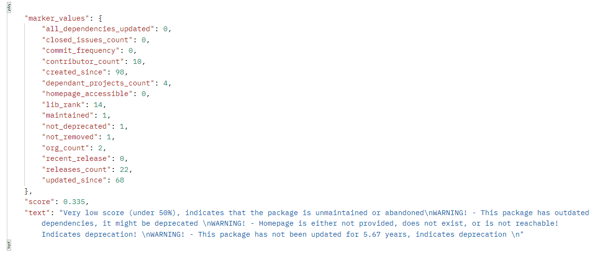
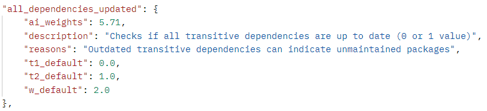

# Introduction 
The tool calculates the health score of open source packages. Under 50% is a very low score which usually indicates insufficiently maintained or abandoned packages. 50% - 60% is still quite a low score and usually the packages in question are insufficiently maintained as well.  
Furthermore, the tool gives various warnings that could flag insufficiently maintained packages, abandoned ones, hostile takeover through maintainer domain hijack, and malicious packages (no malware detection present, only flagging packages that are very fresh or have 0 previous versions).  
## Markers
The tool provides a health score for any open-source library found on Pypi, Maven, npm
and Conda repositories. The score is calculated based on 15 markers which are listed and explained in the list below.

- **Created since** - Projects that exist for a longer period of time can indicate higher usage,
could have more known vulnerabilities spotted and resolved, and are less likely to be
malicious.
- **Updated since** - Projects that have not been updated for a certain amount of time could
be abandoned or insufficiently maintained.
- **Contributor count** - Higher number of contributors indicates a higher chance that the
project is receiving proper updates, support, and resources
- **Organisation count** - Company accounts are likely to be more trustworthy and provide
proper maintenance
- **Commit frequency** - Higher number of commits indicates higher maintenance. 
- **Releases count** - Higher number of releases indicates higher maintenance, less likely to
be malicious, more trusted project.
- **Closed issues count** - Higher number of closed issues indicates higher user involvement
and better maintenance
- **Dependant projects count** - Indicates projects popularity, should be trusted more since
potential vulnerabilities can be caught by more people.
- **Dependencies updated** - Outdated transitive dependencies can indicate unmaintained
packages.
- **Libraries.io** rank - It is a score provided by Libraries.io and is based on several markers.
There is a slight overlap with our markers, but it is also taking into account other ones
(such as is repository present, is the license present, etc.), which is the motivation behind
looking at this rank as well. The higher rank (max. 32) indicates a safer package.
- **Not deprecated** - Checks if the package is marked as deprecated by the author.
- **Maintained** - Checks if the package is marked as unmaintained by the author.
- **Not removed** - Checks if the package is removed from the package manager.
- **Recent release** - Checks if the package had a new version in the last six months. Projects
with a recent release are healthier.
- **Homepage accessible** - When the homepage of a project is non-accessible or does not
exist, it gives a strong indication that the project is abandoned.

## Formula
The formula used to calculate the criticality score can be seen in the below figure.
  

- Si - actual value of a certain marker
- αi - weight of a certain marker
- T1, T2 - lower and upper thresholds of a certain marker.

The logarithm function in the fraction is used to reduce potentially large numbers, and the
fraction of logarithms provides a result in the 0-1 range. The maximum function in the numerator is used if we want a marker to start from a certain threshold. For example, if we assign
T1 = 3 for contributors, it would mean that the minimum value in the nominator would always
be 3. In that case, we are only interested if the project has more than 3 contributors, and not
if it has 0, 1, 2, or 3 contributors, which we consider equivalent. We did not use this threshold
T1 for any of our markers, i.e. we assigned it the value zero (so Si
is always equal or higher),
but we wanted to introduce this option if a certain user wishes to have a nominator threshold.
# Getting Started
## Usage:
### 1. As a desktop application using GUI:  
**Run the main.py script.**  
In the initial GUI window that is displayed, it is possible to choose 4 different ecosystems (PyPi, npm, Maven and conda). Then, simply write the name of the package in question, click calculate health score, and the result will be displayed along with the warning messages (if there are any).  
**Click the "configure" button.**  
By clicking the configure button, a new GUI window opens. There, you can see formula, markers, weights, thresholds and explanations based on which the score is calculated. Moreover, you can change any of the marker weights or thresholds based on your preferances. You have to click the save button at the bottom or the changes will not be saved and will not be used with the new package score calculation. It is also possible to revert to default values at any time, by simply clicking the default button above each column (weights, thresholds).   
Finally, there is an option to use AI calculated optimal weights. However, due to the limited dataset size, the AI weights are incorrect, but the option remains accessible if someone generates a more robust dataset.

### 2. As an API:  
**Run the main_api.py script.**  

- **get health score for a specified platform and package**  
returns marker values, health score and warnings  
`GET http://localhost:5000/score/{platform}/{package}`  
for example: `GET http://localhost:5000/score/npm/pix-diff`  
  
**Query parameters:**  
For AI weights:  
    - ai = true  
For different parameter values:  
    - w_marker = changed_value, t1_marker=changed_value, t2_marker = changed_value, otherwise default  
    - e.g. w_created_since=10, t1_contributor_count=5, t2=updated_since=150  
      
- **get parameter information**   
returns marker description, weights and thresholds  
`GET http://localhost:5000/info/`    

*For simplicity, the information shown in the figure is for only one marker, the real result is information about all 15 markers.* 

## The readme is not finished, you can reffer to chapter 7 of my master thesis found at https://www.cs.ru.nl/masters-theses/2023/J_Vojnovic___Mitigating_supply_chain_attacks_through_detection_of_high-risk_software_dependencies.pdf for more information about the tool.

# This tool is not going to be maintained.
